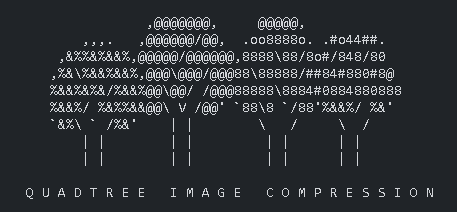
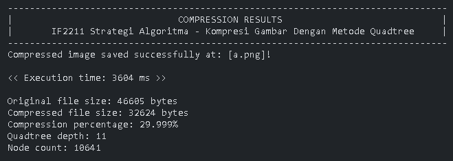

# Tucil2_13523148

> Tugas Kecil 2 IF2211 Strategi Algoritma - Kompresi Gambar Dengan Metode Quadtree

## Table of Contents

-   [Description](#description)
-   [Pre-requisites](#pre-requisites)
-   [Features](#features)
-   [How to Run](#how-to-run)
-   [Bonus Status](#bonus-status)
-   [Technologies Used](#technologies-used)
-   [Screenshots](#screenshots)
-   [Room for Improvement](#room-for-improvement)
-   [Project Structure](#project-structure)
-   [Authors](#authors)

## 📝 Description

This project is a CLI-based image compression tool that utilizes the Quadtree method, implemented in Java. The application compresses images by dividing them into smaller blocks/node (by 4 iteratively), represented as a tree structure, and efficiently reduces the image size while preserving essential details. The compression method is done via DnC (Divide and Conquer) algorithm, with the threshold, minimal block size, and error as a parameter for each node split.

The program accepts image files as input, performs the compression, and outputs results such as runtime, file sizes (original & compressed), compression percentage, quadtree depth, and node count. The project also includes features such as a target percentage compression for input and Structural Similarity Index (SSIM) for error implementation.

## 🪛 Pre-requisites

-   **Running Java**: JDK 11 or higher (tested on JDK 17)
-   **Running Java supported IDE**: IDE for building project (VSCode, IntelliJ IDEA, Eclipse)
-   **Running OS**: compatible with Windows and Linux

## 🏃‍♂️How to Run

1. **Install Java**: Download and install Java (tested on JDK 17) from [here](https://www.oracle.com/java/technologies/downloads/).
2. **Clone the Repository**: Use one of the following commands to clone the repository:

    ```bash
    git clone https://github.com/andrewtedja/Tucil2_13523148.git
    ```

    or

    Download the source code (.zip) from the latest release at [GitHub Repository](https://github.com/andrewtedja/Tucil2_13523148), extract the zip file and open the terminal

3. **Execute the JAR file**:

    ```bash
    java -jar bin/QuadTreeCompressor.jar
    ```

## 🌐 Features

-   Reading input image file (.png/.jpg/.jpeg) from user through CLI:

    -   Input image file path, absolute path (ex: test/input.png)
    -   Error calculation method
        -   Variance
        -   Mean Absolute Difference(MAD)
        -   Maximum Pixel Difference(MPD)
        -   Entropy
        -   SSIM (Structural Similarity Index Measure) (BONUS)
    -   Target compression percentage (BONUS)
    -   Threshold (if target percentage is 0)
    -   Minimum block size (for maximum accuracy of compressed size, set lower values (below 10))
    -   Output file path, absolute path (ex: test/output.png)

-   Showing compression results information, including runtime, file sizes (original & compressed), compression percentage, quadtree depth, and node count
-   Allows user to save the compressed image in all supported formats (.png/.jpg/.jpeg)

## 📷 Screenshots



### Image Comparison

### Original Image


### Compressed Image (10%)


### Compressed Image (30%)


### Compressed Image Results Screen



## 🎁 Bonus Status

| Feature                                               | Status |
| ----------------------------------------------------- | ------ |
| **Target Percentage** Compression                     | ✅     |
| **Structural Similarity Index (SSIM)** Implementation | ✅     |

## 📁 Project Structure

Struktur folder:

```bash
Tucil1_13523148
├── bin
│    ├── QuadTreeCompressor.jar
│    ├── ChannelUtil.class
│    ├── Compressor.class
│    ├── ErrorCalculation.class
│    ├── ImageInfo.class
│    ├── Main.class
│    ├── QuadTreeNode.class
│    ├── ReadInput.class
├── doc
│    ├── Tucil_K3_13523148_AndrewTedjapratama.pdf
├── src
│    ├── ChannelUtil.java
│    ├── Compressor.java
│    ├── ErrorCalculation.java
│    ├── ImageInfo.java
│     ├── Main.java
│    ├── QuadTreeNode.java
│    └── ReadInput.java
├── test
├── img
├── README.md

```

## 🛠️ Technologies Used

-   **Java & JDK**: Version 11 or higher (tested on JDK 17)

## 🚧 Room for Improvement

## 🪪 Author

| NIM      | Nama                                                  |
| -------- | ----------------------------------------------------- |
| 13523148 | [Andrew Tedjapratama](https://github.com/andrewtedja) |
